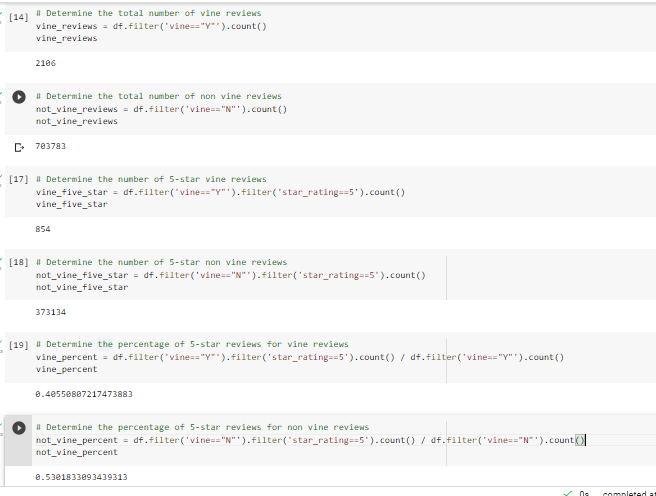

# Amazon_Vine_Analysis

## Purpose
The Amazon Vine Program is a service that allows manufacturers and publishers to recieve reviews for their products. Companies provide their products to Amazon Vine Members and require them to write reviews for their product by paying a small fee to Amazon. The purpose of this analysis is to examine a dataset containing reviews for a specific product to determine if there is any bias towards favourable reviews from Vine members. Specifically, this analysis will be focused on a home entertainment product. The goal is to determine if having paid Vine reviews makes a difference in the amount of 5 star reviews the company recieves. 

## Results

- There were 2,106 Vine reviews and 703,783 non-Vine reviews.
- 854 Vine reviews were 5 stars and 373,134 non-Vine reviews were 5 stars.
- 40.6% of Vine reviews were 5 stars and 53.2% of non-Vine reviews were 5 stars

## Summary
Based on this analysis, there is no positive bias for reviews in the Vine Program versus the non-Vine program. This is because the percent of 5 star Vine reviews is less than non-Vine reviews. 

Some suggestions for additional analysis are: filtering out the non-verified purchases, natural language processing to cateogrize the review as positive or negative (can compare and compile these results with the star-based analysis), and also grouping to categorize less than 4 stars as negative reviews and 4-5 stars as positive reviews (can re-run the analysis to see if this results in a significant difference between vine-reviews and non-Vine reviews). 

## Resources
Data Sources: Amazon review data from https://s3.amazonaws.com/amazon-reviews-pds/tsv/amazon_reviews_us_Home_Entertainment_v1_00.tsv.gz
